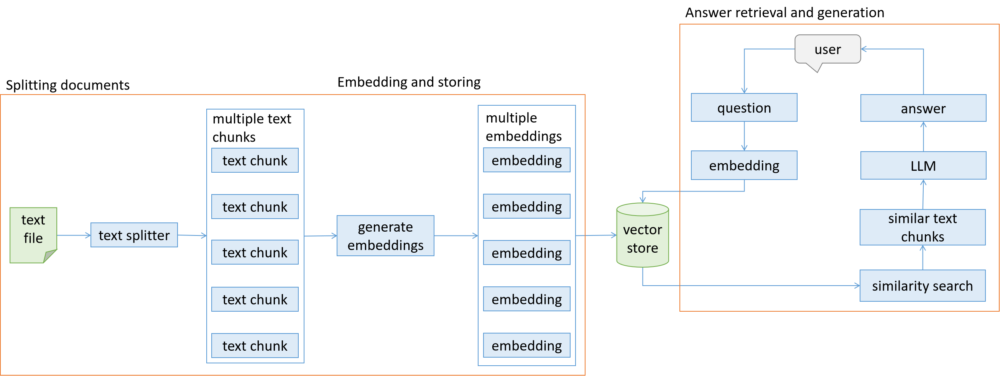
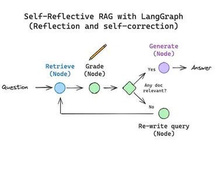

# I-9 Advisor
This is an agentic AI project to create a chatbot that vets an I-9 is ready complete or has errors and to explain to the users steps to complete the form.

This project provides a proof of technology in the form of Jupyter Notebook(s) that demonstrate a Retrieval-Augmented Generation (RAG) using a Large Language Model (LLM).

## Features

The proof of technology demonstrates the ability of LLM to help humans solve problems to improve their own workflow. 

This proof of technology demonstates:

- **Vector database** for a vector search (scraped government website and I-9 documentation)
- LLM Queries that provide the actions humans can take to complete their task in compliance with the rules as described in a set of documentation.
- **AgenticAI** to demonstrate:

    - Accept input of a PDF, and uses optical character recognition of a LLM to idenfity the user information provided
    - Route user question to a vectorstore or web search
    - Use the information retrieved from the vectorstore to answer the question about the input PDF
    - Filter out erroneous retrievals
    - Filter out hallucination
    - Grades the response so we get the right one
- Provides a list of steps for the user to take to complete the form

## Vector database

Vector databases work alongside large language models by storing and efficiently searching through high-dimensional vector representations of text, images, or other data. When text or images are processed by an LLM or embedding model, they're converted into dense numerical vectors that capture their semantic meaning. 

These vectors are then stored in specialized databases optimized for similarity search, using algorithms like Approximate Nearest Neighbors (ANN) to quickly find the most similar vectors to a query. This enables applications like semantic search, where a user's query is converted to a vector and matched against stored document vectors, or retrieval-augmented generation, where relevant context is pulled from the vector database to help ground an LLM's responses in specific knowledge.

From [Azure OpenAI RAG workshop](https://github.com/Azure-Samples/azure-openai-rag-workshop/blob/main/docs/assets/architecture.png)

## RAG

RAG (Retrieval Augmented Generation) combines external knowledge retrieval with LLM capabilities. When given a query, the system first converts it into an embedding vector and uses it to search through a collection of documents/passages that have also been embedded, retrieving the most relevant ones based on semantic similarity. 

These retrieved chunks are then injected into the LLM's prompt along with the original query, allowing the model to generate a response that incorporates both its trained knowledge and the specific external information. This approach helps overcome LLMs' knowledge cutoff limitations and enables them to access up-to-date or domain-specific information while reducing hallucination by grounding responses in retrieved facts.

Diagram from [LLM-RAG](https://github.com/rendy-k/LLM-RAG/blob/main/README.md)

## AgenticAI

LangGraph is a framework for building stateful, multi-agent applications using language models. It allows you to create flow-based applications where different components (which could be language models or other tools) can communicate with each other and maintain state across interactions. 

Think of it like a workflow engine where each node can be a language model performing a specific task, and the graph structure determines how these tasks connect and flow into each other. For instance, you could create a flow where one language model analyzes a document, passes relevant information to another model that generates questions, and then routes those questions to a third model that provides answers, all while maintaining context and state throughout the process.

### Key Concepts of LangGraph

1. **Stateful Graph**: LangGraph revolves around a stateful graph, where each node represents a step in your computation. The graph maintains a state passed around and updated as the computation progresses.

2. **Nodes**: Nodes are the building blocks of your LangGraph. Each node represents a function or a computation step. You define nodes to perform specific tasks, such as processing input, making decisions, or interacting with external APIs.

3. **Edges**: Edges connect the nodes in your graph, defining the computation flow. LangGraph supports conditional edges, allowing you to dynamically determine the next node to execute based on the current state of the graph.

 
Example of LangGraph Workflow from [Building Reliable Agent using Advanced Rag Techniques, LangGraph, and Cohere LLM](https://www.analyticsvidhya.com/blog/2024/05/building-llm-agent-using-advanced-rag-techniques/)

## Key technical advantages

For the purpose of the project, a Naive RAG approach is not sufficient for the following reasons:

- **No Complex Query Understanding**: Inability to break down a complex query into multiple manageable sub-steps, processing the query at a single level instead of analyzing each step and arriving at a unified conclusion.
- **Lack of hallucinations or error handling**: Naive RAG pipelines lack a response verification step and mechanisms to handle hallucinations, preventing them from correcting errors by generating a new response.
- **Lack of dynamic tool use**: A Naive RAG system does not allow the use of tools, calling external APIs, or interacting with databases based on workflow conditions.

An Multi-Agent RAG research system was implemented to address all these issues. An agent-based framework, in fact, allows for:

- **Routing and using tools**: A Routing agent can classify the user’s query and direct the flow to the appropriate node or tool. This enables context-driven decisions, such as determining whether a document requires a full summarization, if more detailed informations are required, or if the question is out of scope.
- **Planning sub-steps**: Complex queries often need to be broken down into smaller, manageable steps. Starting from a query, it is possible to generate a list of steps to execute in order to reach a conclusion while exploring different facets of the query. For instance, if a query requires a comparison between two different sections of a document, an agent-based approach would allow recognizing this need for comparison, retrieving both sources separately, and merging them into a comparative analysis in the final response.
- **Reflection and Error Correction**: In addition to the simple response generation, an agent-based approach would allow for adding a validation step to address potential hallucinations, errors, or responses that fail to accurately answer the user’s query. This also enables the integration of a self-correction mechanism with human-in-the-loop, which incorporates human input into automated processes. Such functionality makes agent-based RAG systems a more robust and reliable solution for enterprise applications, where reliability is a top priority.
- **Shared Global State**: An Agent Workflow shares a global state, simplifying the management of states across multiple steps. This shared state is essential for maintaining consistency across different stages of a multi-agent process.

## Prerequisites

You will need:

- [OpenAI API key](http://platform.openai.com/account/api-keys) with [enough credits](http://platform.openai.com/account/usage)
- Hugging Face API Key

## Set up keys

Once you get your key, put it into a `.env` file as shown in the `_.env` file.

## Technologies

- [Chroma]()
- [LangChain]() Also consider using Hugging Face's Transfomers Chain
- [LangGraph]()  Also consider: [Smolagents](https://github.com/huggingface/smolagents/blob/main/docs/source/en/examples/rag.md) or [CrewAI]()
- [Docling](https://ds4sd.github.io/docling/)

## References

- [Hands-on Implementation of our Agentic RAG System with LangGraph](https://www.analyticsvidhya.com/blog/2024/07/building-agentic-rag-systems-with-langgraph/)
- [Building RAG Research Multi-Agent with LangGraph](https://medium.com/@nicoladisabato_19197/building-rag-research-multi-agent-with-langgraph-1bd47acac69f)
- [RAG with HuggingFace models and Chroma db](https://medium.com/@prajwal_/rag-with-huggingface-models-and-chroma-db-3f6ade28b5fe)
- [Improve RAG performance using Cohere Rerank](https://aws.amazon.com/it/blogs/machine-learning/improve-rag-performance-using-cohere-rerank/)

### Research paper

- [Corrective Retrieval Augmented Generation](https://arxiv.org/pdf/2401.15884)